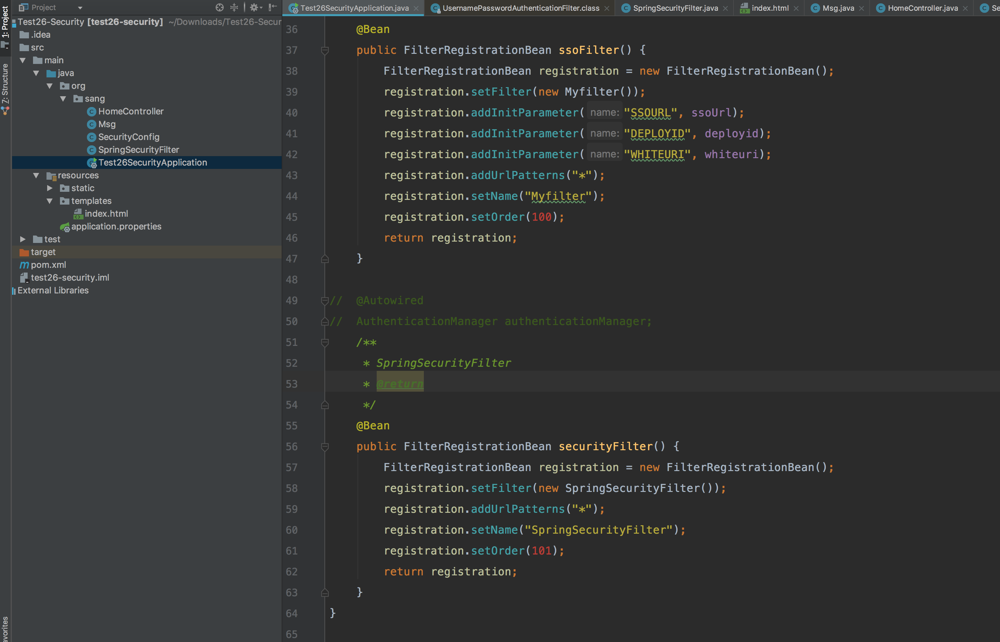

# spring-security-third-party-authentication
spring security 使用第三方登陆，其实就是使用的security的权限管理，不使用它的登陆，运行本项目的时候可以去掉sso，直接测试权限

网上的第三方登陆一搬都是使用github，facebook等一些知名网站的登陆授权，而我这个是使用自己公司内部的登陆系统，使用拦截器的方法实现登陆，然后使用security的角色控制页面的访问权限。

整个流程是：

		> 用户访问本网站，被sso拦截，跳转到sso的登陆界面，在sso登陆成功，将登信息写入到redis中，然后再返回到本网站。

> 到本网站之后，又到sso拦截器，sso发现已经登陆，就将用户信息获取，存到session中去。

> sso拦截器走完之后又到自定义的security拦截器，他的作用就是将session中的数据保存到security中去，然后页面上就可以获取到，并判断用户是否有权限了。

整个项目结构如下：

两个拦截器

配置文件：

自定义的security拦截器：

测试界面：

